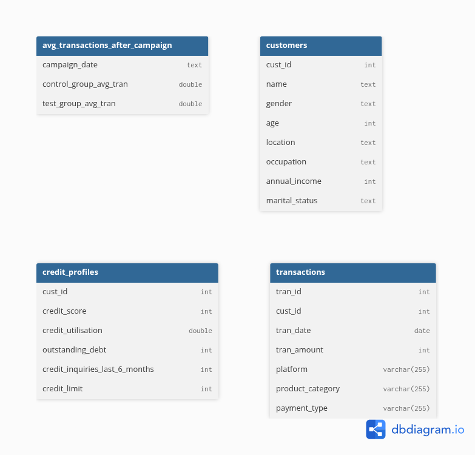

# Database Structure

This project uses a **MySQL** relational database designed to analyze customer transactions, campaign performance, and credit profiles.  
The schema is normalized around core entities: customers, their transactions, and related credit information, with an aggregated view for campaign performance analysis.

---

## Overview

| Table Name | Description | Primary Key | Rows (Approx.) |
|-------------|--------------|--------------|----------------|
| `customers` | Contains demographic and income details of each customer | `cust_id` | — |
| `transactions` | Stores transactional activity linked to customers | `tran_id` | — |
| `credit_profiles` | Captures credit and financial metrics for each customer | `cust_id` | — |
| `avg_transactions_after_campaign` | Holds aggregated transaction averages for test/control groups after campaigns | — | — |

---

## Schema Details

### `customers`
Stores basic demographic and financial attributes of each customer.

| Column | Type | Description |
|---------|------|-------------|
| `cust_id` | INT | Unique customer identifier (referenced in other tables) |
| `name` | TEXT | Full name of the customer |
| `gender` | TEXT | Gender of the customer |
| `age` | INT | Age in years |
| `location` | TEXT | Customer’s city or region |
| `occupation` | TEXT | Job or occupation category |
| `annual_income` | INT | Annual income in local currency |
| `marital_status` | TEXT | Marital status (e.g., Single, Married) |

---

### `transactions`
Represents individual transactions made by customers.

| Column | Type | Description |
|---------|------|-------------|
| `tran_id` | INT | Unique transaction identifier |
| `cust_id` | INT | Foreign key referencing `customers.cust_id` |
| `tran_date` | DATE | Date of the transaction |
| `tran_amount` | INT | Transaction amount |
| `platform` | VARCHAR(255) | Channel or platform used (e.g., online, in-store) |
| `product_category` | VARCHAR(255) | Type or category of product purchased |
| `payment_type` | VARCHAR(255) | Payment method (e.g., credit card, cash) |

---

### `credit_profiles`
Captures financial and credit-related attributes for customers.

| Column | Type | Description |
|---------|------|-------------|
| `cust_id` | INT | Foreign key referencing `customers.cust_id` |
| `credit_score` | INT | Credit score of the customer |
| `credit_utilisation` | DOUBLE | Credit utilization ratio |
| `outstanding_debt` | INT | Total outstanding debt amount |
| `credit_inquiries_last_6_months` | INT | Number of credit inquiries in past 6 months |
| `credit_limit` | INT | Total credit limit available |

---

### `avg_transactions_after_campaign`
Aggregated results comparing control and test group average transaction amounts post-campaign.

| Column | Type | Description |
|---------|------|-------------|
| `campaign_date` | TEXT | Date or label identifying the campaign period |
| `control_group_avg_tran` | DOUBLE | Average transaction amount for the control group |
| `test_group_avg_tran` | DOUBLE | Average transaction amount for the test group |

---

## Relationships

- Each **customer** (`customers.cust_id`) can have multiple **transactions** (`transactions.cust_id`).  
- Each **customer** has one corresponding **credit profile** (`credit_profiles.cust_id`).  
- The **avg_transactions_after_campaign** table is an analytical summary table and does not directly reference other tables through keys.

---

## Diagram

Generated using [dbdiagram.io](https://dbdiagram.io).

---

## Notes
- All tables were modeled in **MySQL** and imported into [dbdiagram.io](https://dbdiagram.io) for visualization.  
- Null defaults are permitted across most columns, indicating optional fields or incomplete data sources.  
- Analytical tables like `avg_transactions_after_campaign` are typically regenerated by reporting or Extract – Transform – Load (ETL) jobs.

---

